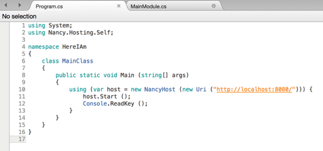
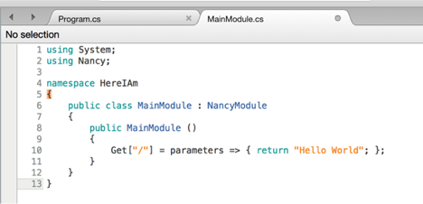

1)  Download and install mono mdk (link when starting monodevelop)
[http://download.mono-project.com/archive/4.0.2/macos-10-x86/MonoFramework-MDK-4.0.2.5.macos10.xamarin.x86.pkg](http://download.mono-project.com/archive/4.0.2/macos-10-x86/MonoFramework-MDK-4.0.2.5.macos10.xamarin.x86.pkg)

2)  Download and install monodevelop for mac os x
[http://download.xamarin.com/studio/Mac/XamarinStudio-5.9.2.4-0.dmg](http://download.xamarin.com/studio/Mac/XamarinStudio-5.9.2.4-0.dmg)

3)  New solution -&gt; .Net -&gt; Console Project

4)  Right click “Packages” -&gt; “Add Package”

5)  Search “Nancey.Hosting.Self” and add

6)  Edit “Program.cs” and add the following in the Main method:
    

7)  Create a class names “LlamaModule.cs” with:
    

8)  Build and debug, open browser to “http://localhost:8080”
